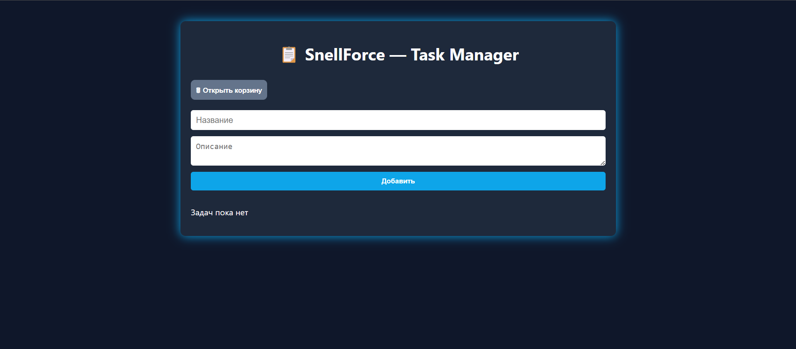
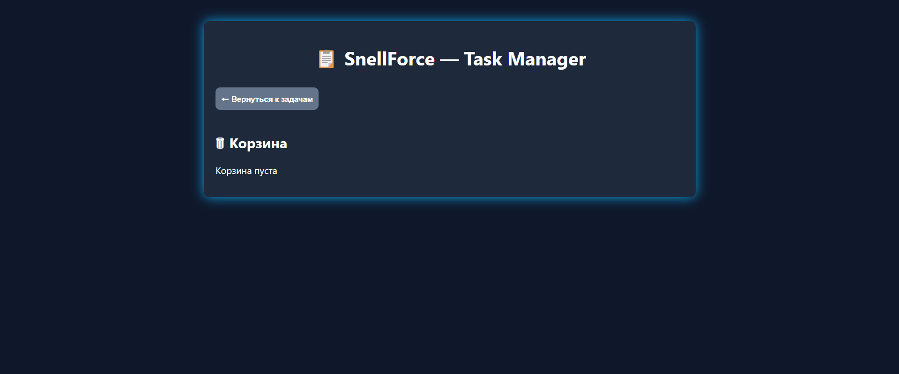

# 📋 SnellForce — Task Manager (SaaS in Progress)

**SnellForce** is a beautifully designed task management application built with a modern stack — **React**, **Express**, and **PostgreSQL**. It offers a simple yet powerful way to manage tasks with soft-deletion support and is actively being developed into a full **SaaS platform**.

> ⚠️ **Note**: This project is in active development. New features will be added soon.

---

## 🌌 Interface Preview

### ➕ Create & View Tasks


### 🗑 Trash Bin


---

## ✨ Features

- 📄 Add tasks with a title and description  
- 📋 See your current task list  
- 🗑 Delete tasks (soft delete — moved to trash)  
- ♻️ Restore tasks or ❌ permanently delete from trash  
- 🎨 Dark modern UI inspired by productivity tools  
- ⚙️ Built for future SaaS integrations

---

## ⚙️ Tech Stack

| Layer     | Technology             |
|-----------|------------------------|
| Frontend  | React, CSS             |
| Backend   | Node.js, Express       |
| Database  | PostgreSQL (Railway)   |
| Hosting   | Railway, GitHub        |

---

## 📦 Folder Structure

```
SnellForce/
│
├── backend/
│   ├── routes/
│   ├── config/
│   ├── .env
│   ├── server.js
│
├── frontend/
│   ├── src/
│   │   ├── components/
│   │   ├── App.js / App.css
│   ├── public/
│
└── README.md
```

---

## ⚙️ Setup Guide

### 🔧 Backend Setup

```bash
cd backend
npm install
cp .env.example .env  # fill in with your DB credentials
npm run dev
```

### 🌐 Frontend Setup

```bash
cd frontend
npm install
npm start
```

> Make sure you have a PostgreSQL DB running and the following tables created:
> `tasks`, `deleted_tasks`, and `users`.

---

## 🧠 Planned Features

SnellForce is being actively developed as a **SaaS product**. Upcoming features include:

- 🔐 User authentication and account system
- ⏰ Due dates, reminders, and task priority
- 🧾 Tags and filters
- 📊 Analytics dashboard
- 👥 Team collaboration & shared boards
- 💳 Subscription plans and billing
- 📁 Project folders and custom workspaces
- 🌐 Internationalization support (i18n)

---

## 🤝 Contact Me

If you'd like to contribute, ask questions, or just say hi:

- **Telegram**: [@ArtemTkachov](https://t.me/ArtemTkachov)  
- **Discord**: `dragonsnel`  

---

## 🛡 License

This project is licensed under the MIT License.  
Feel free to fork, clone, and use — just don’t forget to give credit.

---

> Made with 💙 by **Artem Tkachov (DragonSnel)** | SnellForce © 2025
